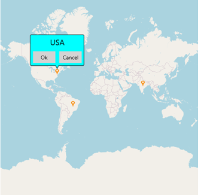

This section explains how to add a button with interaction inside the marker tooltip of [`Xamarin Maps`](https://help.syncfusion.com/cr/xamarin/Syncfusion.SfMaps.XForms.SfMaps.html) (SfMaps).



**Step 1:** Create the SfMaps sample with all necessary NuGets. For more information, please refer to the Xamarin Map [`getting started`](https://help.syncfusion.com/xamarin/maps/getting-started) documentation.

**Step 2:** Initialize the [`Map`](https://help.syncfusion.com/cr/xamarin/Syncfusion.SfMaps.XForms.SfMaps.html) control and add an imagery layer into it, as shown in the following code sample.

**[XAML]**
```
<maps:SfMaps>
    <maps:SfMaps.Layers>
        <maps:ImageryLayer>
        </maps:ImageryLayer> 
    </maps:SfMaps.Layers>
</maps:SfMaps>
```

**Step 3:** Add the required number of custom markers in the imagery layer with corresponding latitude and longitude values.

**[XAML]**
```
…
<maps:ImageryLayer>
    <maps:ImageryLayer.Markers>
        <local:CustomMarker Country="India"
                            Latitude="20.593683"
                            Longitude="78.962883" />
        <local:CustomMarker Country="USA"
                            Latitude="38.8833"
                            Longitude="-77.0167" />
        <local:CustomMarker  Country="Brazil"
                             Latitude="-15.7833"
                             Longitude="-47.8667" />
    </maps:ImageryLayer.Markers>
    <maps:ImageryLayer.MarkerSettings>
        <maps:MapMarkerSetting MarkerIcon="Image"
                               VerticalAlignment="Near"
                               ImageSource="pin.png"
                               IconSize="15">
        </maps:MapMarkerSetting>
    </maps:ImageryLayer.MarkerSettings>
</maps:ImageryLayer>
…
```

**[C#]**
```
public class CustomMarker: MapMarker
{
    public string Country { get; set; }
}
```

**Step 4:** Create the template with buttons and click events, then assign it to the [`TooltipTemplate`](https://help.syncfusion.com/cr/xamarin/Syncfusion.SfMaps.XForms.TooltipSetting.html#Syncfusion_SfMaps_XForms_TooltipSetting_TooltipTemplate) property of [`TooltipSetting`](https://help.syncfusion.com/cr/xamarin/Syncfusion.SfMaps.XForms.TooltipSetting.html). For more information, please refer to the following code sample.

**[XAML]**
```
<maps:MapMarkerSetting.TooltipSettings>
    <maps:TooltipSetting ShowTooltip="True"
                         BackgroundColor="Aqua"
                         StrokeColor="Black"
                         StrokeWidth="1"
                         Duration="1000">
        <maps:TooltipSetting.TooltipTemplate>
            <DataTemplate>
                <StackLayout HeightRequest="70"
                             WidthRequest="130">
                    <Label Text="{Binding Country}"
                           HeightRequest="30"
                           VerticalOptions="Start"
                           FontSize="20"
                           HorizontalTextAlignment="Center" />
                    <Grid>
                        <Grid.ColumnDefinitions>
                            <ColumnDefinition Width="*" />
                            <ColumnDefinition Width="*" />
                        </Grid.ColumnDefinitions>
                        <Button Text="Ok"
                                Margin="2"
                                BackgroundColor="LightGray"
                                Clicked="Ok_Clicked" />
                        <Button Text="Cancel"
                                Margin="2"
                                Grid.Column="1"
                                BackgroundColor="LightGray"
                                Clicked="Cancel_Clicked" />
                    </Grid>
                </StackLayout>
            </DataTemplate>
        </maps:TooltipSetting.TooltipTemplate>
    </maps:TooltipSetting>
</maps:MapMarkerSetting.TooltipSettings>
```

**[C#]**
```
public partial class MainPage : ContentPage
{
…
    private void Ok_Clicked(object sender, EventArgs e)
    {
        // It will be triggered when click the OK button.
    }

    private void Cancel_Clicked(object sender, EventArgs e)
    {
        // It will be triggered when click the Cancel button.
    }
}
```

[`View the sample in GitHub`](https://github.com/SyncfusionExamples/Button-with-interaction-inside-the-marker-tooltip-of-Xamarin-Maps)

## See also

[`How to set the Geo coordinates points to the ImageryLayer?`](https://help.syncfusion.com/xamarin/maps/mapsprovider#set-geo-coordinates-pointscenter-position)

[`How to set markers in imagery layer?`](https://help.syncfusion.com/xamarin/maps/mapsprovider#set-markers-in-imagery-layer)

[`How to load custom map in SfMaps?`](https://help.syncfusion.com/xamarin/maps/mapsprovider#load-custom-map)

[`How to calculate a zoom level based on map geo-bounds?`](https://help.syncfusion.com/xamarin/maps/mapsprovider#geo-bounds)

[`How to calculate a zoom level based on distance?`](https://help.syncfusion.com/xamarin/maps/mapsprovider#distance-in-radius)